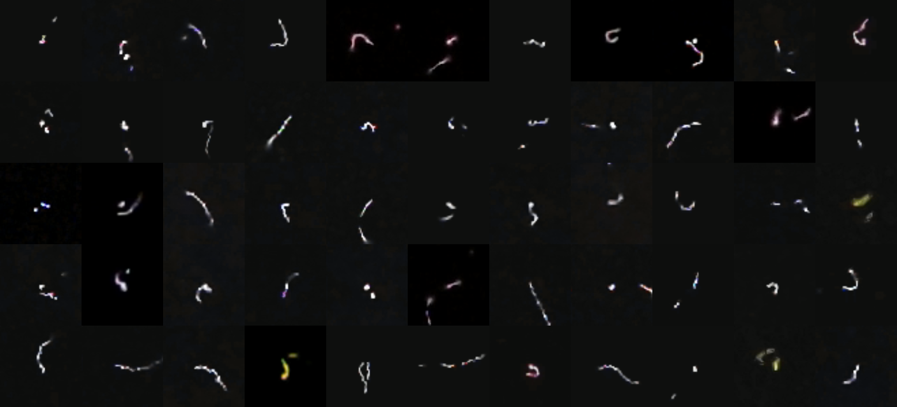

### Source codes for paper

# Towards detection of anomalous cosmic ray signals

## Abstract

In this work, we propose and test a method that allows detection of anomalous cosmic ray signals acquired using CMOS detectors. The method uses unsupervised embedding based on Principal Component Analysis which we named Eigenhits. The embedding generated using Eigenhits allows detection of potential anomalies, defined as images whose position described by the embedding relative to a given measure is above a certain distance threshold from other images. Thus, the problem of anomaly detection was reduced to the problem of detecting outliers which can be solved, for example, using clustering algorithms. We conducted tests of our approach on the CREDO dataset containing 13804 images and obtained satisfactory results demonstrating the stability and effectiveness of the method. According to our best knowledge, no method has yet been proposed that would allow detection of anomalies in images of cosmic ray showers acquired using CMOS detectors. The embedding generation method we propose in this paper and the evaluation of its effectiveness in detecting anomalies in images of cosmic ray showers from CREDO dataset is a pioneering study with many important applications.

Keywords: Cosmic-ray shower; anomalies detection; CMOS detectors; Principal component analysis; Eigenhits.

## Source code author

Author: [Anonymized](Anonymized)

## Requirements

Tested on Python = 3.8; scikit-learn = 1.0.2; scipy = 1.8.

## How to run

Download dataset from: [CREDO dataset (21.8MB)](https://drive.google.com/file/d/1sapfVGzd6Kr-KwLcg0JR5i3de2_MIhHv/view?usp=share_link)

1. Unzip data and put into data/ directory
2. Align images with script [align_images_pca.py](align_images_pca.py)
3. Generate eigenhits with script [generate_eigenhits_grayscale.py](generate_eigenhits_grayscale.py)
4. Generate embedding with script [generate_embedding.py](generate_embedding.py)
5. Perform anomaly detection with Agglomerative clustering [cluster_pca_agglomerative.py](cluster_pca_agglomerative.py)
6. Perform anomaly detection with DBSCAN clustering [cluster_pca_DBSCAN.py](cluster_pca_DBSCAN.py)
7. Perform anomaly detection with OPTICS clustering [cluster_pca_OPTICS.py](cluster_pca_OPTICS.py)

OPTIONAL STEPS
1. Visualize eigenhits with script [visualize_eigenhits.py](visualize_eigenhits.py)

EVALUATION

Folder evaluation contains various python scripts that have been used to evaluate Eigenhits and generate images for our paper.

## Example results

The set of anomalies detected using Agglomerative Clustering at threshold theta = 2.4. Embedding was done using Eigenfaces describing 95% of the variance.

 

## Full text

TO BE ADDED

## Cite as

TO BE ADDED
